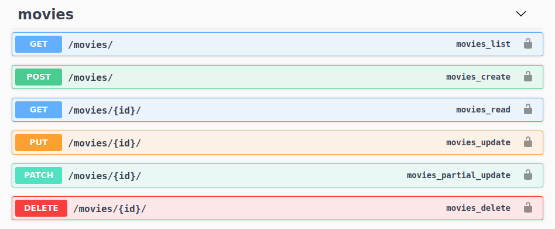
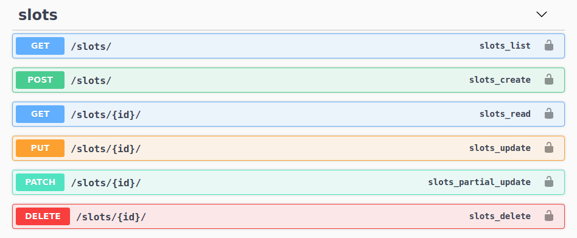
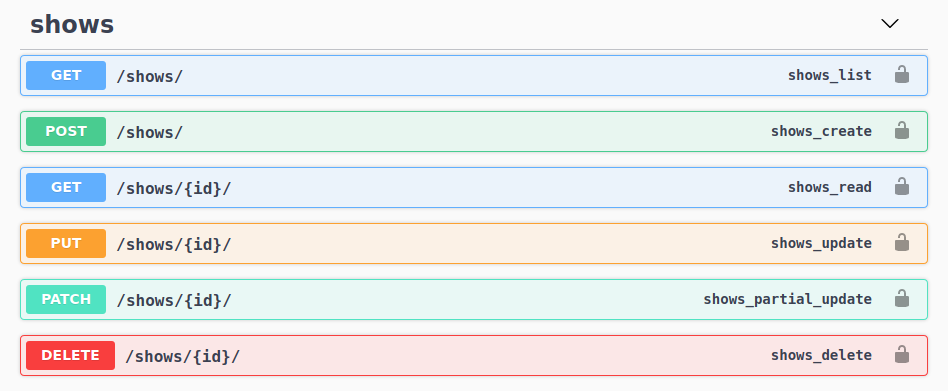
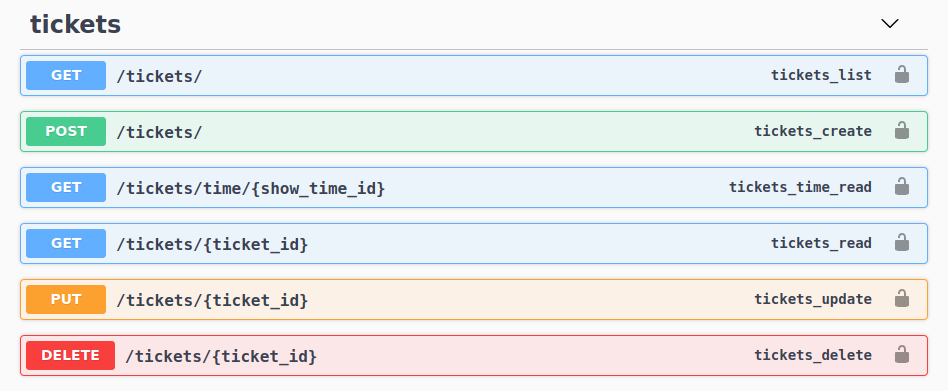

<p align="center">
  
</p>

# Ticket Booking API
        


## Index

- [Index](#index)
- [About](#about)
- [Flow](#flow)
  - [Installation](#installation)
- [File Structure](#file-structure)
- [Guideline](#guideline)
- [Gallery](#gallery)
- [Endpoints](#endpoints)
- [Credit/Acknowledgment](#creditacknowledgment)


## About
This is a REST API on theatre ticket booking system, It was built using Python, Django and Django Rest Framework, the database used is PostgresSQL, It is a fully documented API, It uses Swagger Open API Specification, it has multiple data models namely Movie, Show, Slot, Tickets which are implemeted to meet the requirements of the problem statement, this project was implemented as my submission for the Zomentum hiring challenege for 2021 graduates.

## Flow

- Create/ Read/ Update/ Delete movies in theatre using Movies API.
- Create/ Read/ Update/ Delete Slots for movie shows inside the theatre using Slots API.
- Create/ Read/ Update/ Delete Shows using movies and slots available in the theatre using Shows API.
- Finally Book ticktes using Tickets API.

### Installation

**Development**

To do a simple test run of the application, follow these steps.

- Clone the repository

```bash
$ git clone git@github.com:code-monk08/ticket-booking.git
```

- Create the virtualenv and activate it

```bash
$ cd ticket-booking
$ python -m venv env
$ source env/bin/activate # Linux
```

- Install requirements

```bash
$ pip3 install -r ticket-booking/booking/requirements.txt
```


In order to setups this project, create a .env file in this directory ```./ticket-booking/booking/booking/``` 

```bash
$ cd ./ticket-booking/booking/booking/
$ touch .env
```
- Setup .env file

```
NAME=bookings
USER=your_custom_username
PASSWORD=your_custom_password
HOST=
PORT=
```

- Setup the database

```bash
$ sudo su - postgres
$ psql
postgres=# CREATE USER your_custom_username WITH PASSWORD "your_custom_password";
postgres=# CREATE DATABASE bookings WITH OWNER your_custom_username ENCODING 'utf-8';
postgres=# GRANT ALL PRIVILEGES ON DATABASE "bookings" to your_custom_username;
```

- Setup the project

```bash
$ cd ./ticket-booking/booking/
$ python3 manage.py makemigrations
$ python3 manage.py migrate
$ python3 manage.py runserver
```

## File Structure
- Project structure

```
.
├── booking
│   ├── booking
│   │   ├── asgi.py
│   │   ├── __init__.py
│   │   ├── settings.py
│   │   ├── urls.py
│   │   └── wsgi.py
│   ├── manage.py
│   ├── requirements.txt
│   └── tickets
│       ├── admin.py
│       ├── apps.py
│       ├── cron.py
│       ├── __init__.py
│       ├── migrations
│       │   ├── 0001_initial.py
│       │   ├── 0002_tickets_booking_time.py
│       │   └── __init__.py
│       ├── models.py
│       ├── serializers.py
│       ├── tests.py
│       └── views.py
├── logo
│   └── api.png
└── README.md

5 directories, 20 files
```

## Guideline

- __Code Style__

In order to maintain the code style consistency across entire project we use a code formatter. Therefore, we kindly suggest you to do the same whenever you push commits to this project. 

The python code formatter we chose is called black. Black is a great tool and it can be installed quickly by running 

`pip3 install black`.  

or

`python3.6 -m pip install black`

It requires Python 3.6.0+ to run.

- __Usage__

`black {source_file_or_directory}`

For more details and available options, please check the [GitHub project](https://github.com/psf/black).


## Gallery
<p align="center">
  
</p>

## Endpoints


`Available Views`

- [x] http://127.0.0.1:8000/                    **(Home Page)**
- [x] http://127.0.0.1:8000/api/movies/         **(Movies API)**
- [x] http://127.0.0.1:8000/api/slots/          **(Time Slots API)**
- [x] http://127.0.0.1:8000/api/shows/          **(Shows API)**
- [x] http://127.0.0.1:8000/api/tickets/        **(Tickets API)**
- [x] http://127.0.0.1:8000/api/swagger/        **(Swagger UI)**

`endpoint url structure: /api/. . .`

`Available endpoints: to check the complete specification of API, visit Swagger UI after setting up the project`
<p align="center">
  
</p>
<p align="center">
  
</p>
<p align="center">
  
</p>

`/tickets/`

<p align="center">
  
</p>

## Credit/Acknowledgment

[](https://github.com/code-monk08/ticket-booking/graphs/contributors)